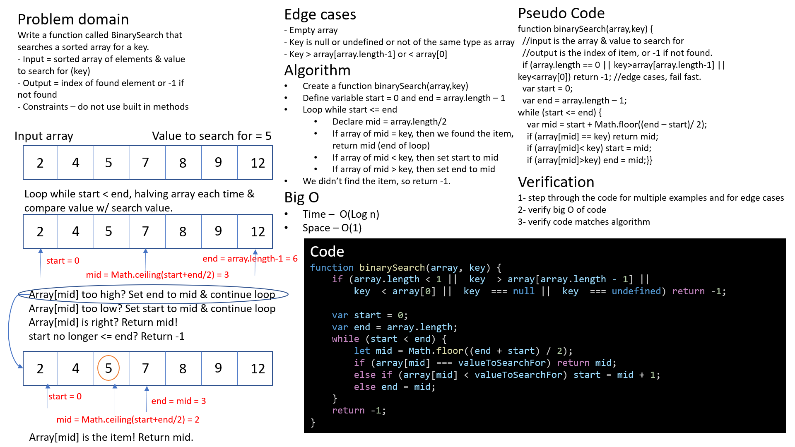

# Challenge Summary

Code challenge for class 03: binary search of a sorted array

Solution by Dina Ayoub

## Challenge Description

Write a function called BinarySearch that searches a sorted array for a key.

- Input = array of sorted numbers & value to search for (key)
- Output = index of found element or -1 if not found
- Constraints – do not use built in methods

Edge cases
- Empty array => return -1 
- If key is any one of these things, return -1:
  - null
  - undefined
  - not of the same type as array
  - key > array[array.length-1]
  - key < array[0]

## Approach

- Create a function binarySearch(array,key)
- Check for error cases that can let us fail fast
- Define variable start = 0 and end = array.length – 1
- Loop while start <= end
  - Declare mid = array.length/2
  - If array of mid = key, then we found the item, return mid (end of loop)
  - If array of mid < key, then set start to mid
  - If array of mid > key, then set end to mid
- We didn’t find the item, so return -1.

## Efficiency (Big O)

- Time –  O(Log n)
- Space – O(1)

## Solution

[Code](array-binary-search.js)