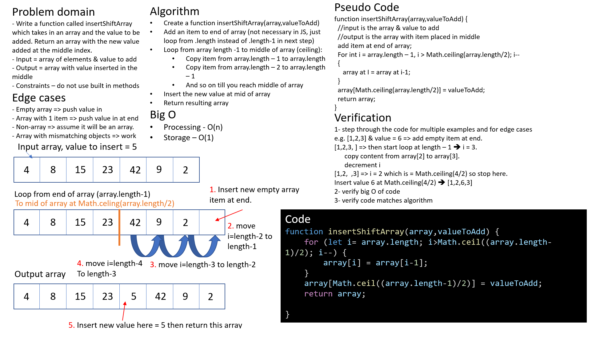

# Challenge Summary
Code challenge for class 02: shifting an array without using built in functions.

## Challenge Description

Write a function called insertShiftArray which takes in an array and the value to be added. Return an array with the new value added at the middle index.

- Input = array of elements & value to add.
- Output = array with value inserted in the middle.
- Constraints – do not use built in methods.

Edge cases
- Empty array => push value in
- Array with 1 item => push value in at end.
- Non-array => assume it will be an array.
- Array with mismatching types => should work as normal.
- Array with odd number of items => insert after middle of original array.
- Array with even number of items => insert exactly in the middle of new array.

## Approach & Efficiency

I took the approach of shifting each item int he second half of the array one spot to the right, in-place, then inserting the item in the middle.

This will loop n/2 times, so time efficiency is O(n).
This will only require one new storage spot at the end of the array, so storage efficiency is O(1).

## Solution
