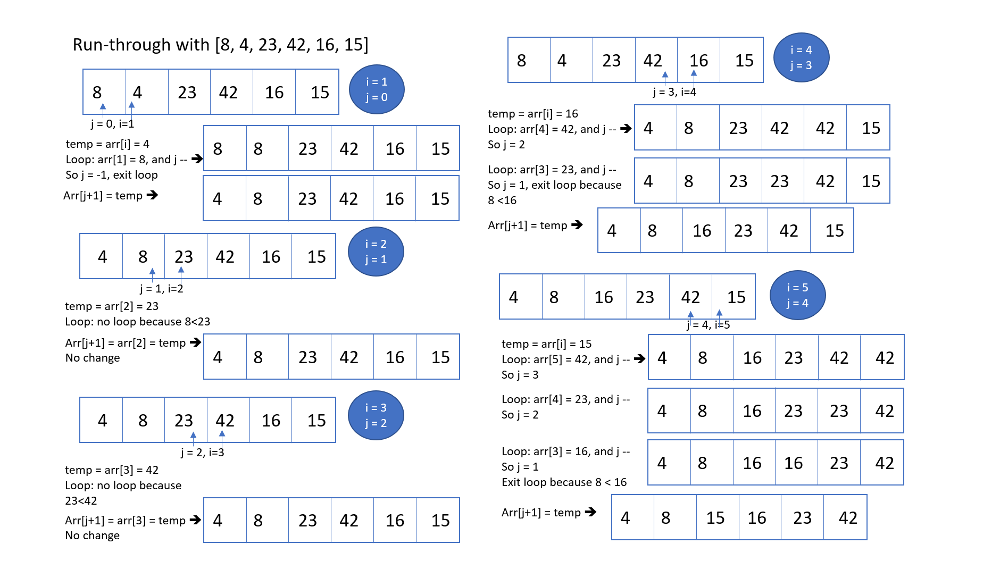

# Challenge Summary

Code challenge for class 26: Insertion sort

Solution by Dina Ayoub

## Challenge Description

* Review the pseudocode below, then trace the algorithm by stepping through the process with the provided sample array. Document your explanation by creating a blog article that shows the step-by-step output after each iteration through some sort of visual.
* Once you are done with your article, code a working, tested implementation of Insertion Sort based on the pseudocode provided.
* Write unit tests

## Efficiency (Big O)

* Time –  O(n^2)
* Space – O(1)

## Testing

[x] Can sort an unsorted array
[x] Can sort a reverse-sorted array
[x] Can sort an array with few uniques
[x] Can sort a nearly sorted array

## Solution

### Pseudo Queue with Stacks

