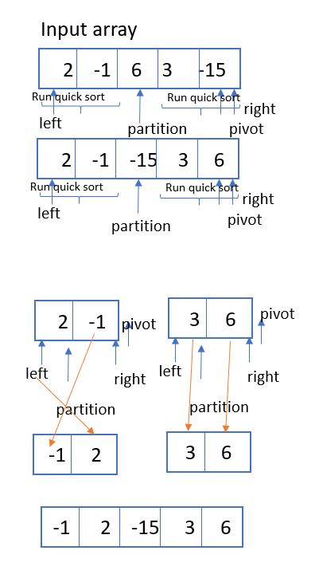

# Challenge Summary

Code challenge for class 28: Quick sort

Solution by Dina Ayoub

## Challenge Description

- Review the pseudocode, then trace the algorithm by stepping through the process with the provided sample array. Document your explanation by creating a blog article that shows the step-by-step output after each iteration through some sort of visual.
- Once you are done with your article, code a working, tested implementation of Quick Sort based on the pseudocode provided.
- Provide a visual step through for each of the sample arrays based on the provided pseudo code
- Convert the pseudo-code into working code in your language
- Present a complete set of working tests

### Psuedo Code

```
ALGORITHM QuickSort(arr, left, right)
    if left < right
        // Partition the array by setting the position of the pivot value
        DEFINE position <-- Partition(arr, left, right)
        // Sort the left
        QuickSort(arr, left, position - 1)
        // Sort the right
        QuickSort(arr, position + 1, right)

ALGORITHM Partition(arr, left, right)
    // set a pivot value as a point of reference
    DEFINE pivot <-- arr[right]
    // create a variable to track the largest index of numbers lower than the defined pivot
    DEFINE low <-- left - 1
    for i <- left to right do
        if arr[i] <= pivot
            low++
            Swap(arr, i, low)

     // place the value of the pivot location in the middle.
     // all numbers smaller than the pivot are on the left, larger on the right.
     Swap(arr, right, low + 1)
    // return the pivot index point
     return low + 1

ALGORITHM Swap(arr, i, low)
    DEFINE temp;
    temp <-- arr[i]
    arr[i] <-- arr[low]
    arr[low] <-- temp
```

## Efficiency (Big O)

- Time – O()
- Space – O(1)

## Testing

[x] Can sort an unsorted array
[x] Can sort a reverse-sorted array
[x] Can sort an array with few uniques
[x] Can sort a nearly sorted array

## Solution

### Quick Sort



### Explanation

Testing with [8, 4, 23, 42, 16, 15]:

- We call quickSort with the array, a left of 0 and a right of the index of the last element in the array ([8,4,23,42,16,15], 0, 5);
  - left 0 is less than right 5, so go into the if condition:
    - declare position = partition with the array, left and right.
      - pivot will be array of right so array[5] = "15"
      - declare low will be left - 1 = -1
      - declare i = left = 0 and loop while i < right = 5, incrementing i with each iteration.
        - array[0] = 8 is less than pivot (15), so increment low to 0, and swap array [0] with array [0] (aka do nothing), then increment i to 1
        - array[1] which is "4" is less than pivot of 15, so increment low to 1, and swap array of 1 with array of 1 (aka do nothing), increment i to 2
        - array[2]  is 23 and is not less than pivot of 15, so just increment i to 3
        - array [3] is 42 and is not less than pivot of 15, so increment i to 4
        - array [4] is 16 and is not less than pivot of 15, so increment i to 5, so loop is done because now i = right.
      - swap array of right (5) with array of low + 1 (2) turning the array into this [8, 4, 15, 42, 16, 23]
      - return low + 1 = 2 as "position"
    - quick sort the array with left of 0 and right of position - 1 = 2-1 = 1 (quickSort([8,4,15,42,16,23], 0, 1))
      - left 0 is less than right 1, so go into the if condition:
      - declare position = partition with the array, left and right.
      - pivot will be array of right so array[1] = "4"
      - declare low will be left - 1 = -1
      - declare i = left = 0 and loop while i < right = 1, incrementing i with each iteration.
        - array[0] = 8 is not less than pivot (4), so increment i to 1 and stop loop because i = right.
      - swap array of right (1) with array of low + 1 (0) turning the array into this [4, 8, 15, 42, 16, 23]
      - return low + 1 = 0 as "position"
      - quick sort the array with left of 0 and right of position - 1 = 0-1 = -1 (quickSort([8,4,15,42,16,23], 0, -1)) => this will do nothing because left is not less than right.
      - quick sort the array with left of position + 1 = 0+1 = 1 and right of 1  (quickSort([8,4,15,42,16,23], 1, 1)) => this will do nothing because left is not less than right.
    - quick sort the array with left of position + 1 = 2+1 = 3 and right of 5  (quickSort([8,4,15,42,16,23], 3, 5))

### References

- <https://www.guru99.com/quicksort-in-javascript.html>
- <https://en.wikipedia.org/wiki/Quicksort>
- <https://www.youtube.com/watch?v=PgBzjlCcFvc&ab_channel=GeeksforGeeks>
