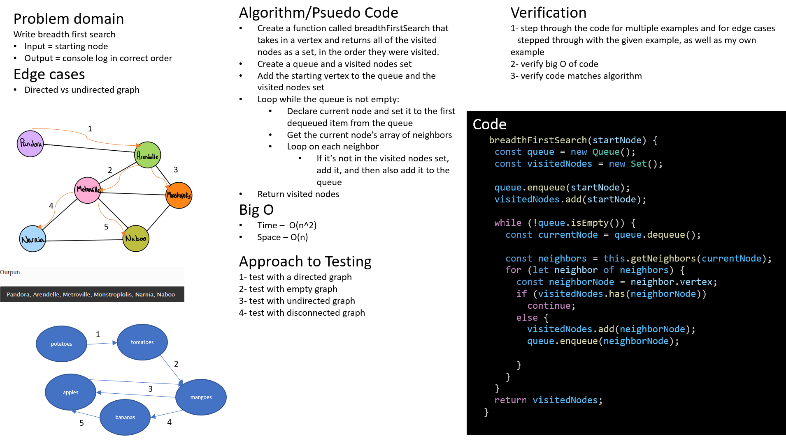

# Graphs

By Dina Ayoub

## Challenge

Implement your own Graph. The graph should be represented as an adjacency list, and should include the following methods:

1. AddNode()
  * Adds a new node to the graph
  * Takes in the value of that node
  * Returns the added node
2. AddEdge()
  * Adds a new edge between two nodes in the graph
  * Include the ability to have a “weight”
  * Takes in the two nodes to be connected by the edge
  * Both nodes should already be in the Graph
3. GetNodes()
  * Returns all of the nodes in the graph as a collection (set, list, or similar)
4. GetNeighbors()
  * Returns a collection of edges connected to the given node
  * Takes in a given node
  * Include the weight of the connection in the returned collection
5. Size()
  * Returns the total number of nodes in the graph
6. breadthFirst()
  * takes in a node
  * prints out the breadth first graph traversal from the given node

## Approach & Efficiency

1. addNode()
  * Time O(1)
  * Space O(1)
2. addEdge()
  * Time O(n) because Map.get is O(n)
  * Space O(1)
3. getNodes()
  * Time O(1) because the Map already exists, we just return it as-is
  * Space O(1) becase we just return a reference to the entire map
4. GetNeighbors()
  * Time O(n) again because Map.get is O(n)
  * Space O(1) - unsure, assuming it returns by reference so not a copy
5. Size() 
  * Time O(1) - assuming Map keeps track of its length while inserting objects, rather than by iterating over them when size is called.
  * Space O(1)
6. breadth First()
  *. Time O(n^2)
  *. Space O(n) because if the graph is just all connected to the provided node, the queue would end up with n-1 nodes. Also because we use a visitedNodes which will house all the nodes at the end (although this doesn't copy the actual nodes, just puts them by reference in a new Set)

## API

1. addVertex(value) - adds a new vertex to the graph with the given value and returns the vertex.
2. addDirectedEdge(firstNode,secondNode,weight) - adds a new edge between two nodes in the graph with the given weight.
3. getNodes() - returns all of the vertices in the graph as a Map
4. getNeighbors(vertex) - returns an array of the edges of the given node, including the weight and the vertex this edge connects the given vertex to.
5. size() - returns the total number of nodes in the graph.
6. breadthFirstSearch(startNode) - starts from the given node and does a breadth first traversal of the tree. returns a Set with all the unique visited nodes.

## Tests

* [x] Node can be successfully added to the graph
* [x] An edge can be successfully added to the graph
* [x] A collection of all nodes can be properly retrieved from the graph
* [x] All appropriate neighbors can be retrieved from the graph
* [x] Neighbors are returned with the weight between nodes included
* [x] The proper size is returned, representing the number of nodes in the graph
* [x] A graph with only one node and edge can be properly returned
* [x] An empty graph properly returns null
