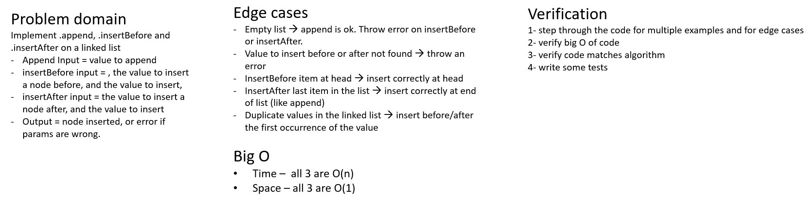
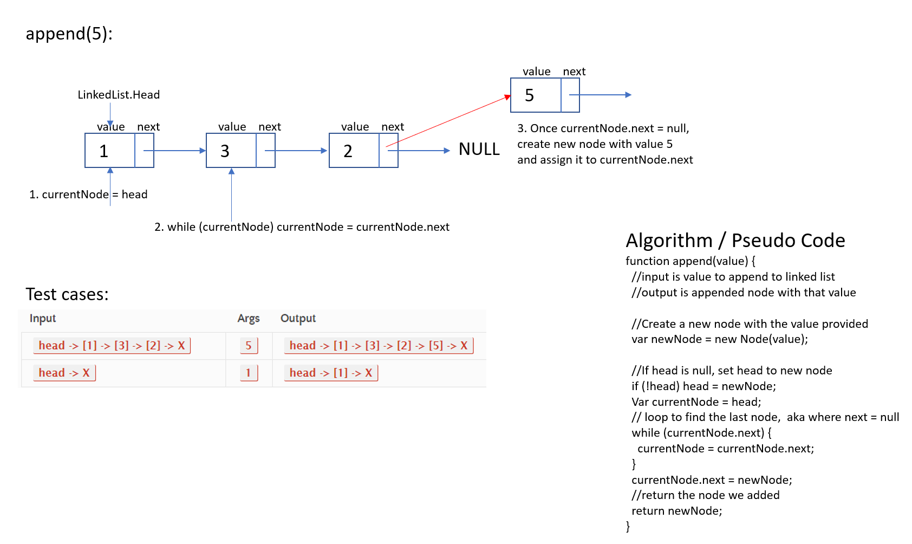
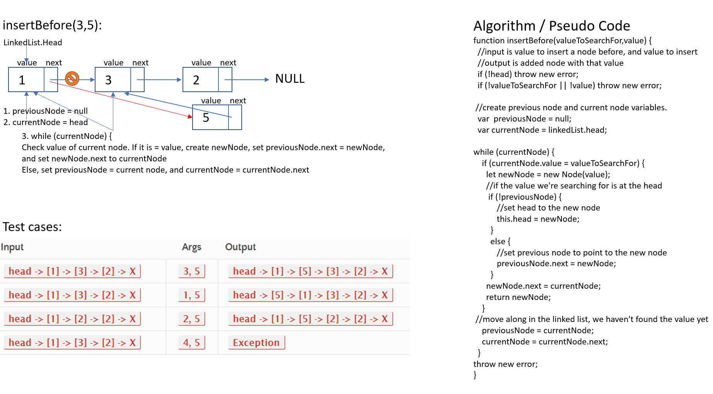
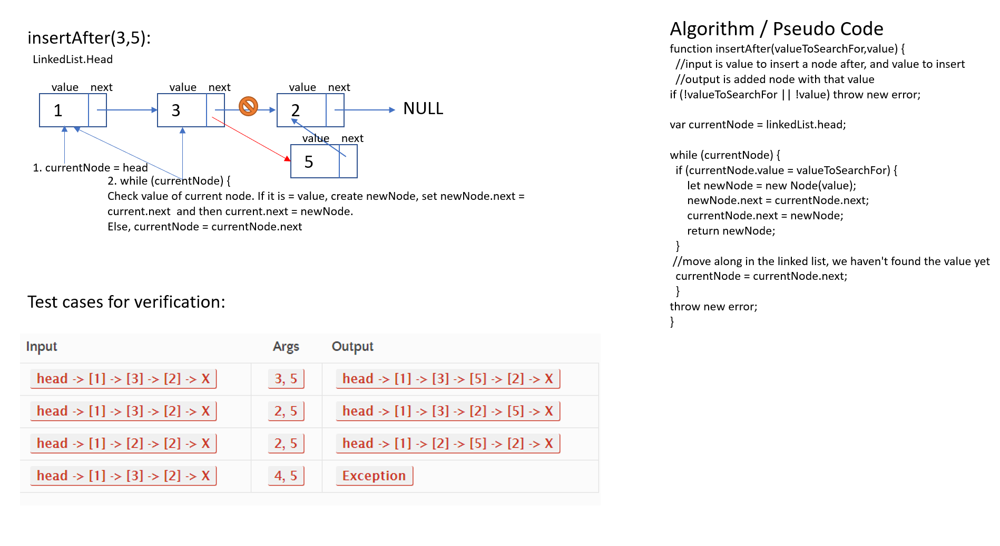
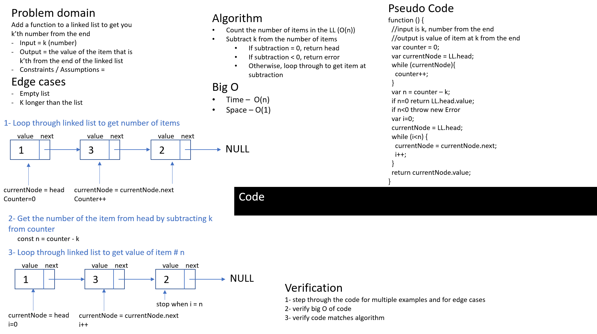

# Challenge Summary

Code challenge for class 05: linked lists

Solution by Dina Ayoub

## Challenge Description

* Create a Node class that has properties for the value stored in the Node, and a pointer to the next Node.
* Within your LinkedList class, include a head property. Upon instantiation, an empty Linked List should be created. Define the following methods:
  * .insert which takes any value as an argument and adds a new node with that value to the head of the list with an O(1) Time performance.
  * .includes which takes any value as an argument and returns a boolean result depending on whether that value exists as a Node’s value somewhere within the list.
  * .toString (or __str__ in Python) which takes in no arguments and returns a string representing all the values in the Linked List, formatted as:
"{ a } -> { b } -> { c } -> NULL"
  * .append(value) which adds a new node with the given value to the end of the list
  * .insertBefore(value, newVal) which add a new node with the given newValue immediately before the first value node
  * .insertAfter(value, newVal) which add a new node with the given newValue immediately after the first value node
  * .kthFromEnd(k) which  takes a number, k, as a parameter and returns the node’s value that is k from the end of the linked list.

## Efficiency (Big O)

insert:
- Time –  O(1)
- Space – O(1)

includes:
- Time - O(n)
- Space - O(1)

toString:
- Time - O(n)
- Space - O(n)

append:
- Time - O(n)
- Space - O(1)

insertBefore:
- Time - O(n)
- Space - O(1)

insertAfter:
- Time - O(n)
- Space - O(1)

kthFromEnd:
- Time - O(n)
- Space - O(1)

## Solution

[Code](linked-list.js)

### Append: append(valueToAppend)

### Insert Before: insertBefore(valueToSearchFor, valueToInsert)

### Insert After: insertAfter(valueToSearchFor, valueToInsert)

### Kth From End: kthFromEnd(k)

