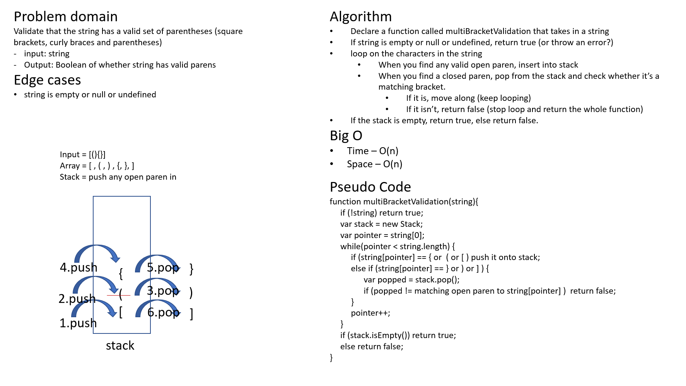

# Challenge Summary

Code challenge for class 13: Multi Bracket Validation

Solution by Dina Ayoub

## Challenge Description

* On your main file, create a function called multiBracketValidation(input)
* Your function should take a string as its only argument, and should return a boolean representing whether or not the brackets in the string are balanced. 
* There are 3 types of brackets:
  * Round Brackets : ()
  * Square Brackets : []
  * Curly Brackets : {}

## Efficiency (Big O)

* Time –  O(n)
* Space – O(n)

## Testing

[x] Can successfully respond with true to strings with no brackets
[x] Can successfully respond with true to strings with balanced brackets
[x] Can successfully respond with false to strings with unbalanced brackets

### Examples:

Input                   Output
{}                      TRUE
{}(){}                  TRUE
()[[Extra Characters]]  TRUE
(){}[[]]                TRUE
{}{Code}[Fellows](())   TRUE
[({}]                   FALSE
(](                     FALSE
{(})                    FALSE
{                       FALSE    error unmatched opening { remaining.
)                       FALSE    error closing ) arrived without corresponding opening.
[}                      FALSE    error closing }. Doesn’t match opening (.

## Solution

