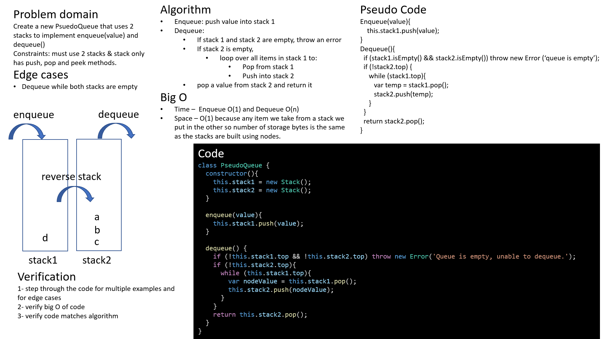

# Challenge Summary

Code challenge for class 10: Stacks & Queues

Solution by Dina Ayoub

## Challenge Description

* Create a Node class that has properties for the value stored in the Node, and a pointer to the next node.
* Create a Stack class that has a top property. It creates an empty Stack when instantiated.
  * This object should be aware of a default empty value assigned to top when the stack is created.
  * Define a method called push which takes any value as an argument and adds a new node with that value to the top of the stack with an O(1) Time performance.
  * Define a method called pop that does not take any argument, removes the node from the top of the stack, and returns the node’s value. Should raise exception when called on empty stack
  * Define a method called peek that does not take an argument and returns the value of the node located on top of the stack, without removing it from the stack. Should raise exception when called on empty stack
  * Define a method called isEmpty that takes no argument, and returns a boolean indicating whether or not the stack is empty.
* Create a Queue class that has a front property. It creates an empty Queue when instantiated.
  * This object should be aware of a default empty value assigned to front when the queue is created.
  * Define a method called enqueue which takes any value as an argument and adds a new node with that value to the back of the queue with an O(1) Time performance.
  * Define a method called dequeue that does not take any argument, removes the node from the front of the queue, and returns the node’s value. Should raise exception when called on empty queue
  * Define a method called peek that does not take an argument and returns the value of the node located in the front of the queue, without removing it from the queue. Should raise exception when called on empty queue
  * Define a method called isEmpty that takes no argument, and returns a boolean indicating whether or not the queue is empty.
* Create a brand new PseudoQueue class. Do not use an existing Queue. Instead, this PseudoQueue class will implement our standard queue interface (the two methods listed below), but will internally only utilize 2 Stack objects. Ensure that you create your class with the following methods:
  * enqueue(value) which inserts value into the PseudoQueue, using a first-in, first-out approach.
  * dequeue() which extracts a value from the PseudoQueue, using a first-in, first-out approach.

## Efficiency (Big O)

PsuedoQueue

* Time –  enqueue O(1), dequeue O(n)
* Space – O(1)

## Testing

### Stacks

[x] Can successfully push onto a stack
[x] Can successfully push multiple values onto a stack
[x] Can successfully pop off the stack
[x] Can successfully empty a stack after multiple pops
[x] Can successfully peek the next item on the stack
[x] Can successfully instantiate an empty stack
[x] Calling pop or peek on empty stack raises exception

### Queues

[x] Can successfully enqueue into a queue
[x] Can successfully enqueue multiple values into a queue
[x] Can successfully dequeue out of a queue the expected value
[x] Can successfully peek into a queue, seeing the expected value
[x] Can successfully empty a queue after multiple dequeues
[x] Can successfully instantiate an empty queue
[x] Calling dequeue or peek on empty queue raises exception

### Pseudo Queues

[x] Can successfully instantiate an empty queue
[] Can successfully enqueue into a queue
[] Can successfully enqueue multiple values into a queue
[] Can successfully dequeue out of a queue the expected value
[] Can successfully empty a queue after multiple dequeues
[] Calling dequeue on empty queue raises exception

## Solution

### Pseudo Queue with Stacks

