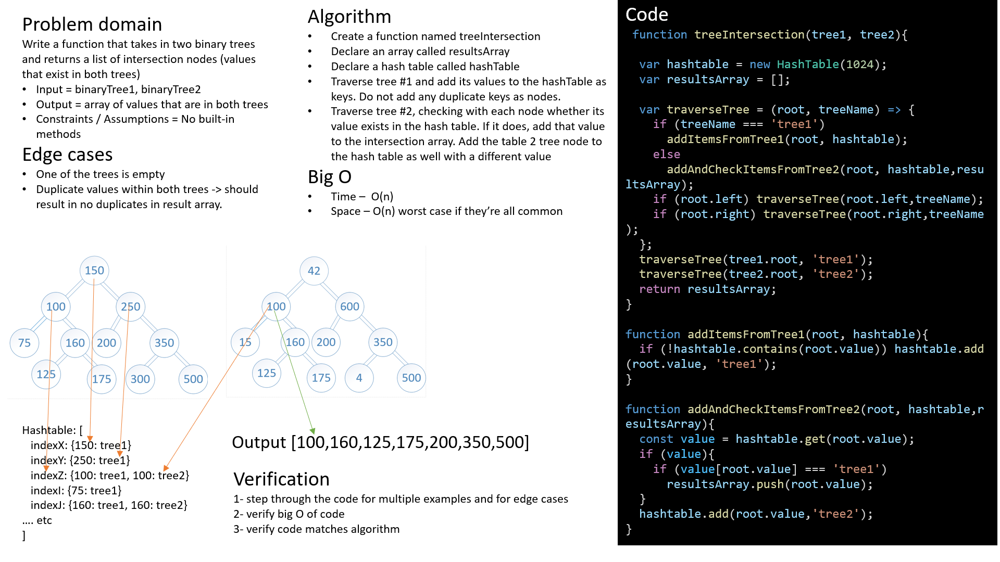

# Challenge Summary

Code challenge for class 32: Tree Intersection

Solution by Dina Ayoub

## Challenge Description

* Write a function called tree_intersection that takes two binary tree parameters.
* Without utilizing any of the built-in library methods available to your language, return a set of values found in both trees.

## Stretch Goals

* Presume you are working with BSTs. How can you improve the performance of your algorithm?

## Examples

* Input:
 
* Output: [100,160,125,175,200,350,500]

## Efficiency (Big O)

* Time
* Space

## Solution

## Tests

* [x] Can return the correct results for two binary trees
* [x] Can return the correct results for two binary search trees
* [x] Can return the correct results if there are duplicates within the same tree
* [x] Can return empty array if either or both of the trees are empty
